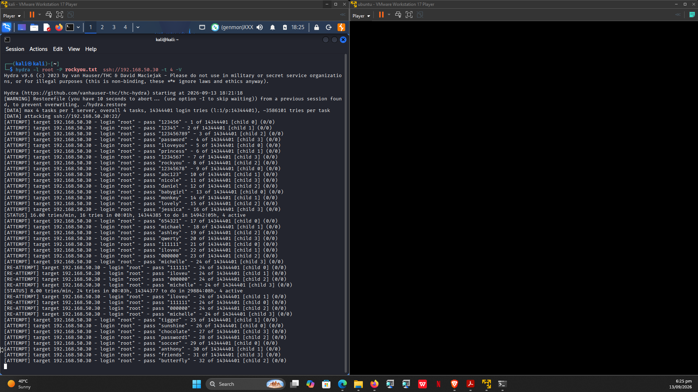
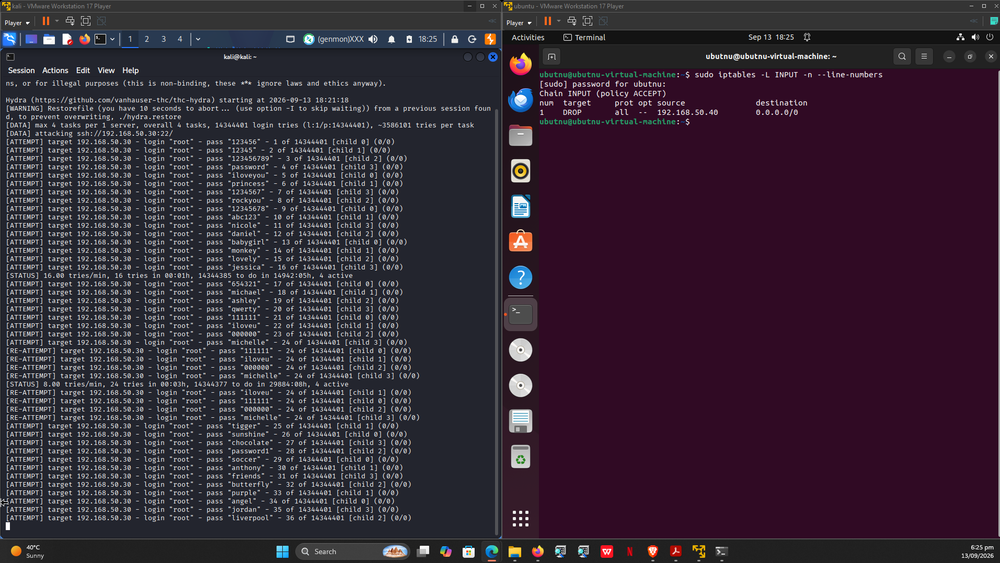
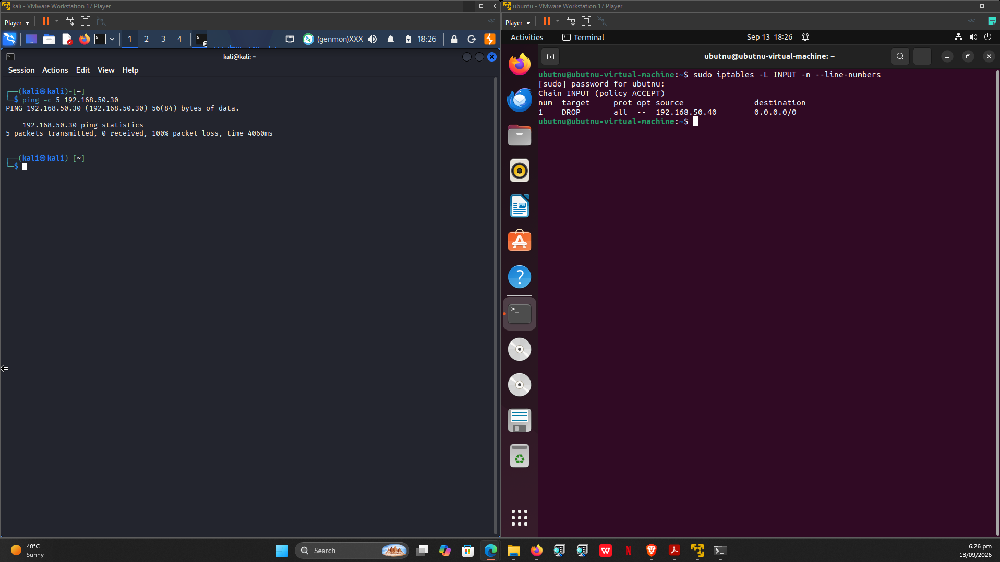
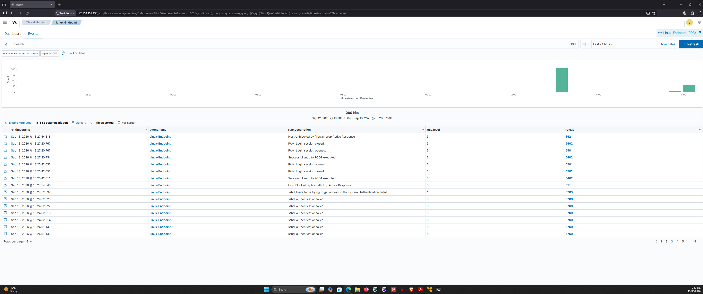

# 05 - Active Response (Automated Containment)

## Objective

Configure Wazuh to **automatically block source IPs** when an SSH brute-force attack is detected — no analyst intervention required.

## How It Works


## Configuration — Wazuh Manager

Edit `/var/ossec/etc/ossec.conf` and uncomment / add:

```xml
<active-response>
  <command>firewall-drop</command>
  <location>local</location>
  <rules_id>5763,5710,5716,5720</rules_id>
  <timeout>180</timeout>
</active-response>
```

Parameter	Purpose
firewall-drop	Built-in command using iptables
local	Run on the agent that fired the alert
5763,5710,5716,5720	SSH brute-force / authentication failure rules
180	Block duration in seconds

#### Restart:

```bash
sudo systemctl restart wazuh-manager
```

## Configuration — Linux Endpoint

```bash
# Ensure firewall-drop script is executable
sudo chmod 750 /var/ossec/active-response/bin/firewall-drop

# Ensure iptables is installed
sudo apt install iptables -y

# Restart agent
sudo systemctl restart wazuh-agent
```

## Attack Simulation

#### From Kali:

```bash
hydra -l root -P /usr/share/wordlists/rockyou.txt ssh://192.168.50.30 -t 4 -V
```

## Verification

#### On the Linux Endpoint

```bash
sudo iptables -L INPUT -n --line-numbers
```

Expected:

```
Chain INPUT (policy ACCEPT)
num  target  prot opt source              destination
1    DROP    all  --  192.168.50.40       0.0.0.0/0
```

#### From Kali

```bash
ping -c 5 192.168.50.30
```
Expected: 100% packet loss while the block is active.

#### On the Wazuh Server

```bash
sudo grep -A 15 "Rule: 601" /var/ossec/logs/alerts/alerts.log | tail -30
```
Alert 601 = "Host Blocked by firewall-drop Active Response."

#### In the Dashboard
Navigate to Threat Hunting → search:

```
rule.id:5763 OR rule.id:601
```

You should see:

- Rule	Description	Level
- 5763	sshd: brute force trying to get access	10
- 601	Host Blocked by firewall-drop Active Response	3


## Auto-Unblock
After timeout seconds, the DROP rule is automatically removed and the attacker regains access.

## Evidence

### SSH Brute Force Attack from Kali



### Firewall Drop Rule Applied by Active Response



### Kali Blocked — 100% Packet Loss



### Wazuh Dashboard — Detection Rules




## MITRE ATT&CK Mapping

Technique	ID
Brute Force: Password Guessing	T1110.001
Brute Force: Password Cracking	T1110.002


## Evidence

### SSH Brute Force Attack from Kali


### Firewall Drop Rule Applied by Active Response


### Kali Blocked — 100% Packet Loss


### Wazuh Dashboard — Detection Rules


