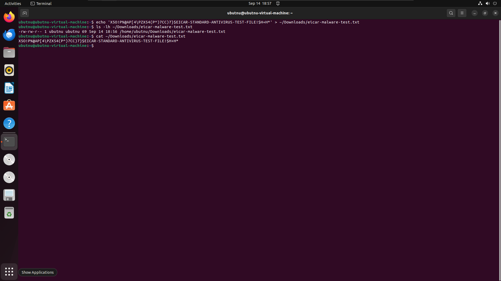
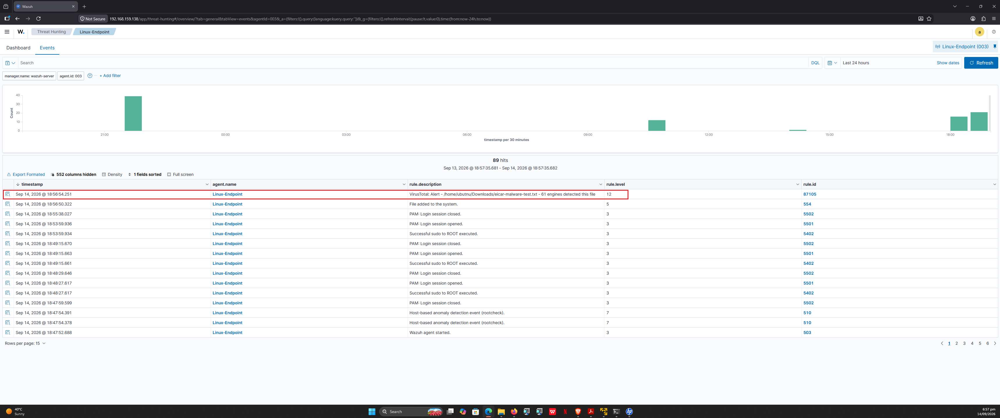

# 06 - VirusTotal Integration

## Objective

Automatically enrich **file integrity monitoring (FIM)** events with VirusTotal threat intelligence. When a new or modified file is detected on an endpoint, Wazuh computes its hash and queries VirusTotal. If the file is flagged by multiple engines, Wazuh generates a high-severity alert.

This enables **L1-style IOC triage**: every suspicious file is automatically scored against 70+ antivirus engines.

## Why This Matters for SOC L1

- **Faster triage:** No manual hash lookups
- **Higher confidence:** Multi-engine verdict reduces false positives
- **Scalable:** Works across every endpoint
- **MITRE ATT&CK aligned:** Supports detection of malware delivery (T1204) and execution (T1204.002)

## Architecture


## Prerequisites

### VirusTotal API Key (Free Tier)

1. Sign up at https://www.virustotal.com
2. Navigate to **Profile → API Key**
3. Copy the key

**Free-tier limits:**
| Limit | Value |
|---|---|
| Requests / minute | 4 |
| Requests / day | 500 |
| Requests / month | 15,500 |

More than sufficient for a lab.

## Configuration — Wazuh Manager

Edit `/var/ossec/etc/ossec.conf` and add the `<integration>` block inside the first `<ossec_config>` (after `<syscheck>`, before `<active-response>`):

```xml
<integration>
  <name>virustotal</name>
  <api_key>YOUR_VIRUSTOTAL_API_KEY</api_key>
  <group>syscheck</group>
  <alert_format>json</alert_format>
</integration>
```

## Parameter	Purpose
name	Built-in integration script virustotal
api_key	Your VT API key
group	Trigger only on syscheck (FIM) events
alert_format	Send alert payload as JSON

## Verify Integration Scripts

```bash
ls -lh /var/ossec/integrations/virustotal*
sudo chmod 750 /var/ossec/integrations/virustotal.py
sudo chmod 750 /var/ossec/integrations/custom-virustotal
sudo chown root:wazuh /var/ossec/integrations/virustotal.py
sudo chown root:wazuh /var/ossec/integrations/custom-virustotal
```
### Restart the Manager
```bash
sudo systemctl restart wazuh-manager
sudo grep -i virustotal /var/ossec/logs/ossec.log | tail -5
```
### Configuration — Linux Endpoint
Ensure the monitored directory exists and is watched:

Edit ```/var/ossec/etc/ossec.conf``` on the Linux-Endpoint, inside ```<syscheck>```:

```bash
<directories check_all="yes" report_changes="yes" realtime="yes">/home/ubutnu/Downloads</directories>
```
Restart the agent:

```bash
sudo systemctl restart wazuh-agent
```

## Test — EICAR File
The EICAR test string is a harmless file that every AV engine (including VirusTotal) flags as malware. Perfect for validating the integration.

### On the Linux-Endpoint:

```bash
echo 'X5O!P%@AP[4\PZX54(P^)7CC)7}$EICAR-STANDARD-ANTIVIRUS-TEST-FILE!$H+H*' > ~/Downloads/eicar-malware-test.txt
```
Wait 30–60 seconds for the pipeline to complete.

## Verification

Integration Log

```bash
sudo tail -30 /var/ossec/logs/integrations.log
```
Expected:

```
 Integration: virustotal
{"virustotal": {"found": "1", "malicious": "58", ...}}
```

### Alerts Log

```bash
sudo grep -A 20 "87105" /var/ossec/logs/alerts/alerts.log | tail -40
```

## Dashboard
Threat Hunting → Events → search rule.id:87105

### Rule ID	Description	Level
554	File added to the system	5
87105	VirusTotal: Alert — N engines detected this file	12

### Rule Reference
Rule	Meaning
554	File added to the system (FIM baseline)
550	Integrity checksum changed
87103	VirusTotal: Low detection rate (1–4 engines)
87104	VirusTotal: Moderate detection (5–49 engines)
87105	VirusTotal: High detection (50+ engines)

### MITRE ATT&CK Mapping
Technique	ID
User Execution: Malicious File	T1204.002

### Troubleshooting
| Issue |	Fix |
|---|---|
| No VT alert |	Check API key spelling in ossec.conf |
| No VT alert |	Confirm <alert_format>json</alert_format> present |
| 403 Forbidden in integrations.log |	Invalid key OR rate limit hit |
| File not detected |	Confirm <directories> monitors the target folder |
| Alert level 0	Missing | alert_format parameter |

## Evidence

### EICAR Test File Created



### Wazuh Dashboard — VirusTotal Alert (Rule 87105)




### Reference

Wazuh VirusTotal integration docs

EICAR test file

VirusTotal API
