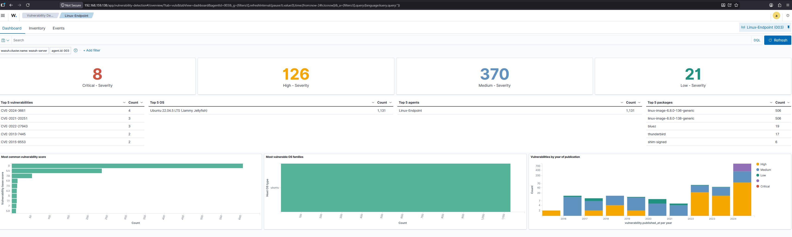
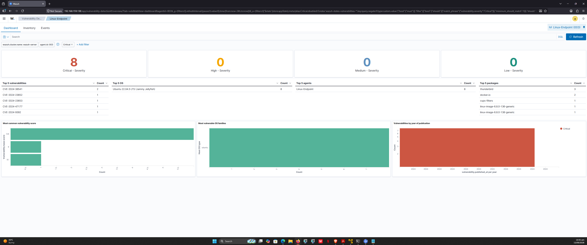
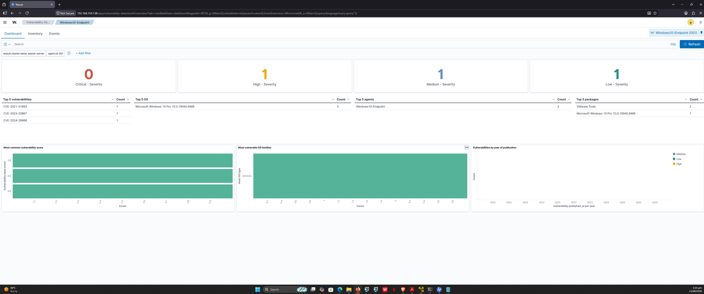

# 07 - Vulnerability Detection

## Overview

Wazuh's Vulnerability Detection module scans installed packages on every agent and correlates them against the NVD (National Vulnerability Database) feed. Results are indexed and visualized in the Wazuh Dashboard.

The module is **enabled by default** and runs on a configurable schedule (default: hourly for the feed, real-time for alerts on new vulnerabilities).

## Scan Results — Linux-Endpoint (2026-09-14)

| Severity | Count |
|---|---|
| 🔴 Critical | 8 |
| 🟠 High | 126 |
| 🟡 Medium | 370 |
| 🟢 Low | 21 |
| **Total** | **525** |

## Top Vulnerable Packages

| Package | CVE Count |
|---|---|
| `linux-image-6.8.0-136-generic` | 506 |
| `linux-image-6.8.0-138-generic` | 506 |
| `bluez` | 19 |
| `thunderbird` | 17 |
| `shim-signed` | 6 |

> **Insight:** ~96% of detected CVEs are in the **Linux kernel**. This is expected due to the kernel's size and continuous discovery of vulnerabilities. It highlights the importance of a strict kernel patch cadence.

## Critical CVEs — Detailed Breakdown

| # | CVE ID | CVSS | Package | Current Version | Description |
|---|---|---|---|---|---|
| 1 | CVE-2024-38541 | 9.8 | linux-image-6.8.0-138-generic | 6.8.0-138.138~22.04.1 | Buffer overflow in `of_modalias()` — potential RCE |
| 2 | CVE-2024-38541 | 9.8 | linux-image-6.8.0-136-generic | 6.8.0-136.136~22.04.1 | Same as above (different kernel version) |
| 3 | CVE-2024-9402 | 9.8 | thunderbird | 140.7.1 | Memory safety bugs → arbitrary code execution |
| 4 | CVE-2024-9401 | 9.8 | thunderbird | 140.7.1 | Memory safety bugs → arbitrary code execution |
| 5 | CVE-2024-9392 | 9.8 | thunderbird | 140.7.1 | Cross-origin page loading vulnerability |
| 6 | CVE-2024-47177 | 9.0 | cups-filters | 1.28.15 | Command injection via FoomaticRIPCommandLine |
| 7 | CVE-2024-23653 | 9.8 | docker.io | 29.1.3 | BuildKit privilege escalation |
| 8 | CVE-2024-23652 | 9.1 | docker.io | 29.1.3 | BuildKit file deletion outside container |

## Prioritization (L1 Triage)

| Priority | CVEs | Rationale |
|---|---|---|
| 🔴 P1 | CVE-2024-47177 (cups-filters) | RCE with network exposure (CUPS port 631) |
| 🔴 P1 | CVE-2024-23653, CVE-2024-23652 (docker.io) | Container escape risk |
| 🟠 P2 | CVE-2024-38541 (kernel ×2) | Kernel RCE — local access required |
| 🟡 P3 | CVE-2024-9401/9402/9392 (thunderbird) | Requires user interaction (phishing) |

## Remediation Plan

```bash
sudo apt update
sudo apt upgrade -y
sudo apt install --only-upgrade cups cups-filters thunderbird docker.io linux-image-generic -y
sudo reboot
```
Expected outcome after reboot: Critical CVEs drop to 0.

## Evidence
See screenshots/06-vulnerability-detection/:

overview-linux.png — Full vulnerability dashboard

critical-cves-linux.png — Filtered Critical view

## Reference
Wazuh Vulnerability Detection docs

NVD — National Vulnerability Database


---

## Windows Endpoint — Vulnerability Results

**Scan date:** 2026-09-15
**Agent:** Windows10-Endpoint (ID 001, IP 192.168.50.20)

### Severity Breakdown

| Severity | Count |
|---|---|
| 🔴 Critical | 0 |
| 🟠 High | 1 |
| 🟡 Medium | 1 |
| 🟢 Low | 1 |
| **Total** | **3** |

### Detected CVEs

| CVE | Severity | Package | Count | Notes |
|---|---|---|---|---|
| CVE-2021-31693 | High | VMware Tools | 1 | Local access, DoS/info disclosure |
| CVE-2023-20887 | Medium | VMware Tools | 1 | Local privilege escalation |
| CVE-2024-29988 | Low | Windows 10 Pro | 1 | Minor info disclosure |

### Top Vulnerable Packages

| Package | CVE Count |
|---|---|
| VMware Tools | 2 |
| Microsoft Windows 10 Pro 10.0.19045.6466 | 1 |

### Analysis — Why Windows Shows Fewer CVEs

- Windows Update patches OS components automatically
- The VM is a clean install — no third-party apps like Chrome, Java, Adobe
- The main residual risk is **VMware Tools**, which lags behind vendor updates
- Wazuh's Windows vulnerability scanner relies on the Microsoft CVE feed, so only missing patches appear

### Remediation

**Windows Update (PowerShell):**
```powershell
Install-Module PSWindowsUpdate -Force
Get-WindowsUpdate -Install -AcceptAll -AutoReboot
```

## VMware Tools:
Update via VMware Workstation menu → VM → Install VMware Tools.

## Evidence

### Linux Endpoint — Vulnerability Overview



### Linux Endpoint — Critical CVEs



### Windows Endpoint — Vulnerability Overview




## Key Comparison — Linux vs Windows
| Platform |	Critical |	High |	Medium |	Low	Total |
|---|---|---|---|---|
| Linux-Endpoint |	8 |	126 |	370 |	21 |	525 |
| Windows-Endpoint |	0 |	1 |	1 |	1 |	3 |

#### Insight: Linux endpoints show dramatically higher CVE counts due to kernel sprawl and package diversity, while patched Windows systems show far fewer.


